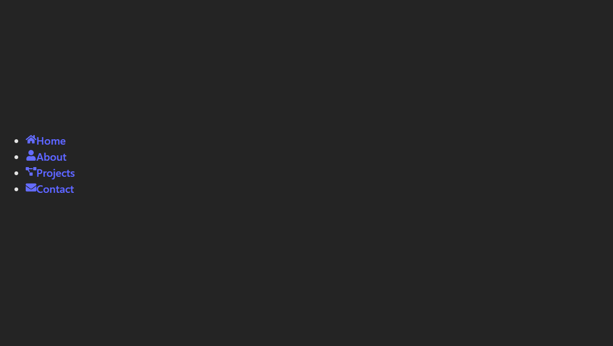

# Making my Portfoilo Website 

# Day 1 : Mindmap 
August 14 

> 1. Starts with an Empty Stage(index.html)
  2. Finds a special magic box with the ID "root"
  3. Puts all your UI inside that box using components
  4. index.html  →  main.jsx  →  App.jsx  →  Other Components

It’s a domino chain — one file triggers the next.

> Going to src/App.jsx  and deleting the boilerplate code that already exist and now updating with our basic 
code and running using ` npm run dev `

install 
> npm i lucide-react
lucide-react is a React icon library — basically, a collection of clean, modern SVG icons you can use in your                         
 React components without having to design them yourself.

Day 1 Work: 
 